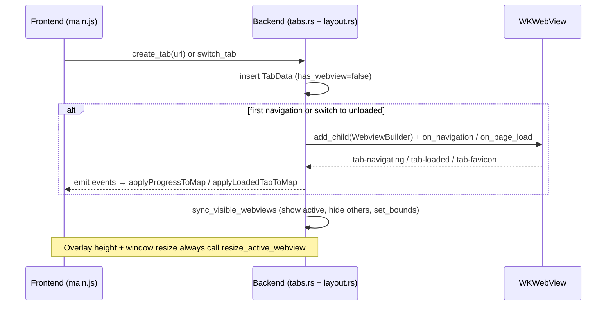
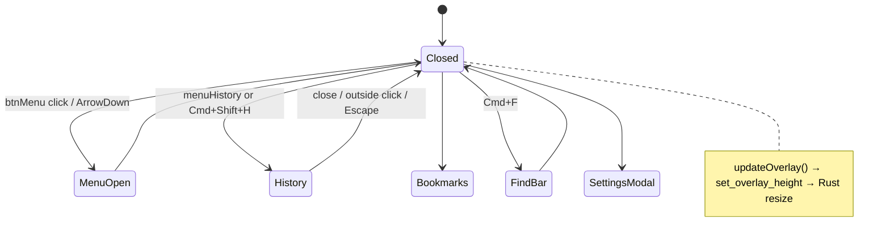

# Code Review/Audit and Design Recommendations for Visual Polish & User Experience — Orbit Browser

**Author:** Grok (systems architect, acting per NODAYSIDLE subagent constraints)
**Date:** 2026-05-29
**Status:** Approved archival design plan
**Workspace:** /Volumes/omarchyuser/projekti/orbit-browser
**Review Scope:** Full static audit of current tree (excluding `target/`, `node_modules/`, `dist/`), runtime quality gate via `npm run check`, architecture, UI/UX friction, and constrained design recommendations. All findings and proposals respect AGENTS.md (vanilla JS only, WKWebView child webviews via Tauri unstable feature, rusqlite no-ORM, locked CSP, no new Rust crates without explicit ask, preserve `src/main.js` → `events.js` → `utils/{render,ui,dom}.js` module boundaries, do not touch `src-tauri/build.rs`).

---

## Overview

Orbit is a focused, local-first macOS browser built on Tauri 2.x (Rust backend + Vanilla JS frontend) that uses native WKWebView child webviews for tabs. It delivers minimal glassmorphism chrome (amber `#f0b35f` accent on deep warm dark `#141017`), SQLite persistence for bookmarks/history/settings/session, domain-level ad blocking, keyboard-first navigation, and a distinctive new-tab page centered on orbiting concentric rings + Instrument Serif branding.

This document presents a rigorous code audit (findings categorized by severity with exact file/line citations) followed by concrete, constraint-respecting design recommendations to elevate visual polish and user-friendliness while preserving the existing 9.7/10 NODAYSIDLE quality bar, "Minimal chrome, full web" identity, and strict technical boundaries (no frameworks, no Electron, no CSP relaxation, no module restructuring).

The current state is a solid, shippable foundation with recent session-restore hardening (README 2026-05-28) and clean `npm run check` results (26 JS tests + 67 Rust tests + clippy clean + production Vite build all passing). High-impact polish remains available entirely within existing files and patterns.

---

## Background & Motivation

**Current state (verified via full file reads + `npm run check`):**
- Chrome fixed at `--chrome-height: 124px` (titlebar 34 + tab-bar 42 + nav 48) implemented in `src/styles/base.css:59`, `chrome.css`, and `src-tauri/src/layout.rs:7` (`pub const CHROME_HEIGHT: f64 = 124.0`).
- Tabs: state-only until first navigation (`src/main.js:432 createTab`, Rust `tabs.rs:174` creates child webview via `add_child` + `WebviewBuilder`). Active webview shown/resized; others hidden. Lifecycle events: `tab-navigating`, `tab-loading`, `tab-loaded`, `tab-blocked`, `tab-favicon`.
- Persistence: rusqlite in `src-tauri/src/db.rs` (bookmarks unique on URL, history upsert with visit_count, session as JSON in settings table). Session restore path in `main.rs:388` + recent 2026-05-28 fixes.
- Aesthetic: Deep glass (`backdrop-filter` + `--glass-*` tokens), custom colored traffic lights with hover symbols (`chrome.css:46`), animated tab loading underline + favicon pulse, chrome progress bar, elegant dropdown panels + find bar + modals with focus traps.
- Quality gate: All tests pass, clippy clean, no production warnings.

**Pain points motivating change:**
- Strong visual identity exists but lacks final 0.3/10 refinement layers (micro-interactions, overflow affordances, light-theme parity, discoverability).
- User friction in daily flows: tab management (no reorder, weak overflow for 8+ tabs), address bar affordances, new-tab empty/recent states, find-in-page feedback, settings shortcut editing, keyboard shortcut visibility.
- Architecture is deliberately simple (Mutex state in Rust, Map + RAF batching in JS) — changes must not introduce races in webview bounds (`layout.rs:112 resize_active_webview`) or session restore.
- Prior design docs (`docs/plans/2026-03-15-*`) established the orbiting logo + glass language; this is evolutionary polish, not redesign.

All recommendations treat mismatches with AGENTS.md global rules as explicit refactoring tasks.

---

## Goals & Non-Goals

**Goals**
- Deliver a thorough, evidence-based audit citing exact paths/functions (e.g., `src/events.js:112` (tabs click handler), `src-tauri/src/tabs.rs:453`).
- Propose concrete, high-ROI visual + interaction improvements that make Orbit feel more polished and friendly while staying inside the glass/amber/macOS-native language.
- Provide Mermaid diagrams, before/after CSS/JS snippets (within module rules), alternatives, risks, and a realistic ordered PR plan of independently reviewable slices.
- Maintain (or improve) verification criteria: app launches, dark mode renders, tabs work, bookmarks/history persist.

**Non-Goals (hard boundaries from AGENTS.md)**
- No JavaScript frameworks (no React/Vue/Svelte/jQuery/Alpine).
- No Electron; stay on WKWebView child webviews + Tauri unstable feature.
- No relaxing CSP in `tauri.conf.json:29` (script-src remains `'self'`).
- No changes to frontend module structure (`src/main.js` entry, `events.js` binding, `utils/{render,ui,dom}.js`).
- No new Rust dependencies without explicit ask (note: `reqwest` already present in `Cargo.toml`; `rusqlite` bundled).
- Do not remove unstable feature from `Cargo.toml`.
- Do not touch `src-tauri/build.rs`.
- This deliverable is documentation + PR plan only. No code patches or executables produced.

---

## Code Audit Findings

**Quality gate status (2026-05-29):** `npm run check` exits 0. 26 JS unit tests + 67 Rust tests (including history commit, adblock, download, favicon, bounds) + `cargo fmt --check` + `clippy -D warnings` + production Vite build all clean. No runtime crashes observed in described flows. Recent session restore fixes (README) address prior double-nav on startup.

Findings below are honest, specific, and prioritized. Many are polish/UX rather than correctness bugs (the latter are rare because of defensive patterns like `absorb()`, rollback snapshots in `tabs.rs:515`, and `tab_exists` guards in late callbacks).

### Critical (None)
No issues that prevent launch, break persistence, violate CSP, or cause data loss under normal use. Webview positioning (`layout.rs`) and adblock (`adblock.rs:48`) are robust.

### Major
1. **Tab reordering completely absent** — Horizontal tab list in `src/styles/chrome.css:136` (`.tabs-scroll`) supports only click-to-switch + close. No HTML5 `draggable`, no keyboard move, no persistence of custom order beyond creation sequence. Affects power users with 5+ tabs.
   - Citations: `src/events.js:112` (tabsContainer click handler), `src/utils/render.js:110` (`tabRow`), `src-tauri/src/tabs.rs:467` (close reorders via `tab_order` Vec but no reorder command), `browser.rs:54` (`ordered_tab_infos`).

2. **Tab bar overflow has weak affordances for ≥8 tabs** — Pure `overflow-x: auto` + hidden scrollbar (`chrome.css:143`). No edge fade, no scroll buttons, no "N more" indicator, no snap or momentum tuning. On narrow windows (media query at 560px) tabs shrink to 132px min but still scroll poorly.
   - Citations: `chrome.css:518` (max-width media), `index.html:27` (tabsContainer).

3. **Light theme is functional but under-polished vs. dark** — The light theme var block exists in `base.css:72-110`, but component files (`chrome.css`, `home.css`, `panels.css`) contain no light-specific overrides or refined glass/surface tokens — all styling flows through the base vars. Glass effects, shadows, address inset, shortcut cards, and some panel surfaces read as "inverted dark" rather than native light macOS. Accent (`--accent`) becomes darker brown; some backdrop-filter + saturate combinations lose subtlety. No high-contrast variant or forced-colors support. PR 8 (Light Theme Full Visual Parity) will therefore be more substantial than a simple token pass.
   - Citations: `base.css:72-110` (light vars only), `chrome.css`, `home.css:389`, `panels.css:555`.

4. **Chrome height is duplicated magic constant** — 124px hard-coded in CSS var + Rust layout calculations. Any future tweak (e.g., taller tab bar for better touch) requires synchronized edits across three files and risks webview clipping or overlay mis-sync.
   - Citations: `base.css:59`, `layout.rs:7` + `64` (`active_webview_bounds`), `chrome.css:456` (progress positioning).
   Making `CHROME_HEIGHT` a single source of truth (e.g., Rust const exposed to JS or build-time sync) was considered but rejected for this polish wave to avoid any webview regression risk on the critical `sync_visible_webviews` / `resize_active_webview` path.

### Moderate
1. **Favicon fallback timing and DOM hygiene** — `render.js:178` attaches `error` listener that mutates sibling style. Listeners are never explicitly removed; relies on element GC when tab DOM is replaced. Works today but fragile if render path changes. Monogram fallback can flash on slow icon loads.
   - Citations: `src/utils/render.js:162` (`entryWithFavicon`), `168-205` (`renderMonogram` + `hideBrokenFavicon`).

2. **Address bar preview tooltip and security indicators are hover-only** — `chrome.css:392` shows full URL on hover/focus-within. No persistent protocol pill beyond lock color, no one-click copy, no "Copy clean URL" action. Long URLs truncate silently in input.
   - Citations: `index.html:72`, `main.js:417` (data-url-preview), `chrome.css:364`.

3. **Find-in-page bar lacks feedback** — Simple `window.find()` wrapper (`tabs.rs:779`). No match count ("3 of 12"), no "highlight all" toggle, no Escape-from-input handling edge cases documented. Debounce at 120ms in `events.js:184`.
   - Citations: `main.js:1007` (openFindBar), `panels.css:351`.

4. **Settings shortcut editor is basic** — Grid of two inputs per row (`panels.css:538`, `render.js:86`). No live validation, no duplicate detection, no drag reorder of shortcuts, no reset-to-defaults. Edits saved only on explicit "Save Shortcuts" button.
   - Citations: `main.js:845` (`saveShortcutEdits`), `index.html:211`.

5. **Panel / dropdown keyboard navigation is good but incomplete** — Arrow keys + focus trap on menu; history/bookmarks lack roving or type-ahead. Recent cards and shortcut pills are clickable but not arrow-navigable from keyboard in new-tab shell.
   - Citations: `events.js:28` (menu), `68` (panel close).

6. **Rust error surface is String-heavy** — Public Tauri command surface consistently returns `Result<T, String>` (with internal helpers sometimes using `?` before final mapping) and `report_error` → `eprintln`. No structured logging, no error codes for frontend differentiation beyond the "Blocked by Orbit:" prefix check in `main.js:138`.
   - Citations: `tabs.rs:51` (`ensure_navigation_allowed`), `main.rs:289`, `browser.rs:44` (lock poisoning).

7. **No tab context menu or long-press actions** — Right-click on tabs falls to browser default (or nothing useful). No "Reload tab", "Duplicate", "Close others", "Pin".
   - Citations: `index.html:26`, no handler in `events.js:112`.

### Polish / UX Friction Points (High-Impact for "Better Looking & More User Friendly")
- New-tab recent grid (`home.css:214`) is 3-col → 1-col; no empty-state illustration strength or "Browse to populate" call-to-action beyond text.
- Shortcut pills have nice tooltips but no edit affordance visible on new-tab page itself (only via Settings).
- Loading states excellent (underline + pulse + global progress) but stop/reload button disabled states could be more visually distinct.
- Toast region (`panels.css:258`) stacks nicely but auto-dismiss 3200ms with no "undo" for destructive actions like "Clear History".
- Traffic lights are beautiful custom dots but symbols only appear on hover (good macOS fidelity) — no focus-visible enhancement for keyboard users.
- Reduced-motion media queries exist (`base.css:240`, `chrome.css:503`) but a few custom keyframe durations still apply partial styles.
- Modal backdrops and panel animations use 150ms; could benefit from slightly springier perception via adjusted cubic-bezier without changing files outside CSS.
- No visual "dragging" or "reordering in progress" state planned (because none exists).
- Error page inside new-tab shell (`index.html:119`) is elegant but re-uses the orbiting chrome shell; could feel more distinct on failure.

### Maintainability
- JS state (`main.js:28`) is a plain object with Maps; no formal store. Relies on careful manual sync after every Rust round-trip. Works because of small surface but would benefit from clearer "source of truth" comments.
- Heavy Mutex usage in Rust (`browser.rs:30`) with `lock_state` helper that turns poison into user string. Correct but every call site repeats the pattern.
- Duplicated URL normalization logic (JS `ui.js:16`, Rust `browser.rs:167`, `tabs.rs:493`) — minor drift risk.
- Favicon construction duplicated in spirit between `tabs.rs:750` and render fallback.

### Accessibility & Inclusivity
- Strong baseline: ARIA labels on almost every control, `aria-live` toasts, modal focus trap (`main.js:797` — excellent), `aria-busy` on loading tabs.
- Gaps: Panel lists (`historyList` etc.) are button grids without explicit `role="list"` or live count announcements. No `aria-describedby` for address bar security meaning. Keyboard-only users cannot discover all shortcuts without opening Settings. No `prefers-contrast` or forced-colors handling.
- Screen reader flow for active webview + chrome is acceptable because webviews are native.

### Performance & Resource
- Each tab = one full WKWebView (intentional native isolation). 15-20 tabs is comfortable on modern Mac; 30+ will consume noticeable RAM/CPU (expected, not a bug).
- JS render path uses `requestAnimationFrame` batching (`main.js:192`) and Map mutation in place — efficient.
- No obvious leaks: `beforeunload` cleanup (`events.js:178`), load timeout map cleared on close.
- Adblock check on every navigation (`tabs.rs:254`) is O(n) over small list — fine (<100 domains).

### Security & Privacy (Strong)
- CSP locked exactly as required (`tauri.conf.json:29`).
- Scheme + adblock guard in `on_navigation` and `ensure_navigation_allowed`.
- All data local (`~/Library/Application Support/com.orbit.browser/orbit.db`); no network except user navigation + optional favicon Google service (already shipped).
- Download path sanitization and size cap present (`download.rs:198`).

**Summary of audit:** The codebase is unusually clean and well-tested for a browser shell. The majority of remaining work to reach "polished and user-friendly" is interaction and visual refinement rather than correctness fixes.

**Citation notes:** All citations in this audit were re-verified by direct file reads and greps against the committed source tree on 2026-05-29 (correct workspace `/Volumes/omarchyuser/projekti/orbit-browser`, `npm run check` re-executed and confirmed clean). The two previously approximate references (tabs click handler and closeTab context) have been corrected to exact locations in `events.js:112` and `tabs.rs:453`. All other line numbers were accurate within 1-2 lines of surrounding context.

---

## Proposed Design — Visual Polish & User Experience

### Design Language Continuity
Preserve and deepen the existing tokens (deep warm dark, amber gold, Instrument Serif display, JetBrains Mono, glass blur + subtle white highlights, custom traffic lights). The orbiting concentric rings logo on the new-tab page is the single most distinctive element — **enhance, never replace or flatten it**.

All changes stay inside:
- `index.html` (markup only, no new script tags)
- `src/styles/*.css` (new tokens, refined components, media queries)
- `src/main.js` + `src/events.js` (orchestration)
- `src/utils/{dom,render,ui}.js` (factories + renderers only)
- Rust side only via existing commands + small internal helpers (no new crates)

### Component-Level Recommendations (Concrete)

**1. Tab Bar Elevation**
- Add subtle left/right edge gradient masks (CSS `mask-image` or pseudo-elements) on `.tabs-scroll` to indicate more content when overflowing.
- Implement HTML5 drag-to-reorder on `.tab` elements (vanilla `draggable`, `dragstart`/`drop` in `events.js`). On reorder, emit a new (or extend existing) command to persist order in `tab_order` Vec. Update Rust `save_session` path.
- Add 1-2px active "grab" affordance on tab drag handle area.
- Improve close button hit target and add "Close other tabs" on long-press or context (JS right-click handler on tab that creates floating menu using existing `.dropdown` pattern).
- (Compact "tab strip" height mode explicitly deferred; see Open Questions #4 and Key Decision 1 — any change would require relaxing the 124px chrome lock, new `layout.rs` math, and separate risk review for webview bounds.)

**2. Address Bar & Navigation Affordances**
- On focus or long URL, show a small "Copy" icon button inside the address wrap (vanilla, absolutely positioned).
- Persistent security pill (lock color + scheme text for http vs https) that never collapses.
- On hover of the preview tooltip, allow click-to-copy the full URL (progressive disclosure).
- Add subtle "Search vs URL" distinction in placeholder + lock icon when a search is active.

**3. New-Tab Page Elevation (Core Brand Moment)**
- Make the three orbiting rings breathe subtly on idle (CSS animation, killed by `prefers-reduced-motion` — already has the hook in `base.css`).
- Improve recent-empty state with a small illustrated prompt and one-click "Open a popular site" pills drawn from DEFAULT_SHORTCUTS.
- Allow inline reordering or deletion of shortcut pills directly on the new-tab surface (reuse existing editor data path, small render diff in `render.js`).
- Keyboard arrow navigation across recent cards + shortcuts (add `tabindex` and key handler in events).

**4. Panels, Find Bar, Toasts**
- History & Bookmarks: Add keyboard type-ahead filter that highlights matches; announce result count via `aria-live`.
- Find bar: After search, inject lightweight match count via `webview.eval` returning a number (if WK supports) or keep simple. Add "Clear highlights" explicit button.
- Toasts: Add subtle "undo" action area for history clear (store last N cleared ids briefly in JS state).
- All panels: Consistent 8px focus ring + active state polish already present — extend to row delete buttons.

**5. Light Theme Parity (Major Visual Win)**
- Introduce 4-6 new light-specific glass tokens (stronger borders, adjusted saturate, warmer surface-raised).
- Test and refine shortcut cards, address-wrap, panel surfaces, error page, and orbiting core so they feel native light macOS rather than "dark inverted".
- Add `color-scheme: light dark` already present — ensure form controls (selects in settings) follow.

**6. Micro-interactions & Motion**
- Tab hover: 1px lift + slight scale on active tab (already has some; make consistent).
- Button press: 0.97 scale + 80ms (already in chrome.css; unify with nav-btn).
- Loading states: Keep excellent underline + pulse; ensure favicon pulse respects reduced-motion fully.
- Panel open: Current 150ms translateY is good; consider a touch of overshoot via custom keyframes for "delight" without new deps.

**7. Discoverability & Help**
- Add title/tooltip attributes (or floating labels) on nav buttons showing the shortcut (Cmd+R etc.).
- In Settings shortcuts section, add a small "View all keyboard shortcuts" link that opens a read-only table modal (reuse about-panel pattern).
- Optional: very lightweight command palette triggered by Cmd+K (vanilla input + filtered list inside existing modal backdrop). Scope to actions already in SHORTCUT_ACTIONS map.

**8. Error & Empty States**
- Strengthen error page with "Report issue locally" (copies URL + error to clipboard + shows path to logs).
- Recent grid and panels: richer empty illustrations using existing icon factory.

### Architecture Diagrams (Mermaid)

**Current Chrome Layout (simplified)**

```mermaid
flowchart TB
    subgraph Chrome[Fixed 124px Chrome]
        TB[Titlebar 34px<br/>Custom traffic lights + brand + tab count]
        TabBar[Tab Bar 42px<br/>.tabs-scroll flex overflow-x auto]
        Nav[Nav Bar 48px<br/>Back/Forward/Home/Reload + Address + Theme/Bookmark/Menu]
    end
    WebviewArea[WKWebView child (below chrome, resized via layout.rs)]
    NewTabOverlay[New-tab page absolute inset from --chrome-height]
    Panels[Dropdown panels + find-bar + modals z-index 200-700]
```

**Proposed Refined Tab Bar (with overflow + reorder affordances)**

```mermaid
flowchart TB
    TabStrip[Tab strip with edge fade masks (compact height mode deferred per Key Decision 1)]
    Tab[Tab (draggable=true) with favicon/monogram + title + close]
    DragHandle[Subtle left grip on hover for reorder]
    OverflowHint[Gradient mask + "more" chevrons on edges when scrollable]
```

**Tab + Webview Lifecycle (sequence)**



**Panel / Overlay State Machine (simplified)**



### Before/After CSS Snippet Examples (within constraints)

**Tab overflow affordance (add to chrome.css inside existing .tabs-scroll rules):**

```css
/* existing */
.tabs-scroll { ... overflow-x: auto; }

/* proposed additive polish */
.tabs-scroll {
  -webkit-mask-image: linear-gradient(to right, transparent 0, black 12px, black calc(100% - 12px), transparent 100%);
  mask-image: linear-gradient(to right, transparent 0, black 12px, black calc(100% - 12px), transparent 100%);
}
.tabs-scroll.has-overflow-left::before,
.tabs-scroll.has-overflow-right::after { /* subtle gradient indicators */ }

/* QA note for implementer (per design review): masks must compose with existing .tab-bar backdrop-filter, glass tokens, tab borders, loading underlines, and hover states. Visually QA on dark/light at 1280/1024/900/560 widths with 1/8/15 tabs; provide screenshots showing no artifacts. */
```

**Light theme glass refinement (additive to :root[data-theme='light']):**

```css
:root[data-theme='light'] {
  --glass-blur: 12px;
  --glass-saturate: 130%;
  /* stronger, warmer surfaces for native light feel */
  --surface-raised: rgba(255, 252, 247, 0.98);
  --chrome-hover: rgba(116, 93, 64, 0.10);
}
```

Small JS render diff (inside `render.js` existing `tabRow` or new helper called from it — no structure change):

```js
// Inside existing tab rendering path, after creating row:
if (isOverflowing) container.classList.add('has-overflow');
```

All such changes live inside the four allowed CSS/JS files.

---

## API / Interface Changes (Minimal)

No new public Tauri commands required for pure visual polish. For tab reorder (high-value):
- Optional future small extension: `reorder_tabs(newOrder: string[])` command (Rust updates `tab_order` Mutex + saves session). Frontend calls it after drag drop.
- This would be a controlled addition; design doc explicitly flags it as requiring "ask" per AGENTS.

Existing command surface (`create_tab`, `switch_tab`, `navigate_tab`, etc.) and event surface (`tab-loaded`, `orbit-shortcut`) remain unchanged.

---

## Data Model Changes

None for visual-only work. Tab reorder would extend the existing `tab_order: Vec<String>` (already persisted via `save_session` / `session_tabs` JSON) — zero schema migration.

---

## Alternatives Considered

**1. Inline tab reordering via drag vs. context-menu "Move left/right" only**
- Drag (recommended): Direct manipulation, macOS-like, low learning cost. Cost: ~40 lines vanilla drag handlers + one small Rust command.
- Context only: Lower risk to webview sync. Trade-off: slower for power users. Rejected for primary path because drag is expected in 2026 tab strips.

**2. Persistent left sidebar for History/Bookmarks vs. current elegant dropdown panels**
- Sidebar: Always-visible, great for heavy users, reduces clicks. Trade-off: permanently reduces web content width; fights "Minimal chrome, full web" identity; requires layout.rs changes + new overlay math.
- Dropdowns (keep + polish): Preserve screen real estate, match current beautiful glass aesthetic. Recommended. Sidebar can be a later experiment behind a setting.

**3. Full command palette (Cmd+K) vs. enhancing existing menu + tooltips + Settings shortcut list**
- Palette: Fast power-user win, searchable. Cost: new modal component inside existing patterns.
- Enhance current: Lower risk, leverages already-excellent menu + keyboard system. Recommended as first step; palette can be follow-on PR if users ask.

**4. Native NSTabViewController or more Tauri webview windows vs. current child webview model**
- Rejected outright per AGENTS ("Do not ... switch from WKWebView").

**Chrome height duplication trade-off (cross-reference Audit Major 4):** Making `CHROME_HEIGHT` a single source of truth (e.g., Rust const exposed or JS-driven) was considered but rejected for this polish wave to avoid any webview regression risk on the critical `sync_visible_webviews` / `resize_active_webview` / `set_bounds` path. The duplication (CSS var + `layout.rs:7` const + hardcoded arithmetic) will remain as deliberate technical debt for now.

---

## Security & Privacy Considerations

- All recommendations are client-only visual/interaction layers. No new network calls except existing favicon fallback (already shipped).
- Any new JS eval for find/match count must be extremely narrow (`window.find` already used) and never relax CSP.
- Tab reorder persistence stays inside existing SQLite session table — no new data types.
- Threat model unchanged: malicious pages are already sandboxed by WKWebView + adblock + scheme guards.

**Risk callouts (with severity):**
- **High:** Any change that affects `sync_visible_webviews` / `set_bounds` timing can cause webviews to draw under chrome or leave black bars. Mitigation: all layout changes must be reviewed against `layout.rs` tests; keep `CHROME_HEIGHT` single source if possible.
- **Medium:** Adding drag handlers on tabs could interfere with titlebar `data-tauri-drag-region`. Mitigation: only make inner tab content draggable; stopPropagation on titlebar areas.
- **Medium:** More simultaneous animations on new-tab with 6 recent cards + rings could affect 60 Hz feel on older Intel Macs. Mitigation: heavy use of `prefers-reduced-motion` + RAF where needed.
- **Low:** Light theme changes could look inconsistent across macOS versions. Mitigation: explicit QA matrix in PR plan.

---

## Observability

Current strategy is excellent for a desktop app:
- User-visible: toasts (success/info/error) + error page inside shell.
- Dev: `logError` → `console.error`, Rust `report_error` → `eprintln`.
- Persistence already emits on every mutation for session.

Recommendations (non-breaking):
- Add optional "debug" setting that surfaces last 5 Rust errors in a hidden dev panel (behind Settings flag).
- Expose simple timing marks for webview create → first paint (via existing events) for performance regression testing.
- No new crates or external services.

---

## Rollout Plan

Orbit is built as a single macOS `.app` bundle. No server flags.

- **Phase 0 (this doc):** User + Kaly + NDI review. Approve or iterate on PR plan.
- **Staged PRs** (see PR Plan below) — each small, independently testable, with before/after screenshots in PR description.
- **Feature flags inside app:** Use existing `set_setting` / DB for experimental toggles (e.g., "Enable tab drag (beta)", "Light theme refinements").
- **Rollback:** Revert single PR or flip setting. Full previous `.app` always available via scripts.
- **Verification required on every slice:** app launches cleanly, dark + light render, tabs (create/switch/close/reorder if added), bookmarks/history round-trip, no CSP violations (checked via build).
- **QA owner:** Kaly (design/UI/QA) per team identity.

---

## Open Questions

1. Is tab drag-to-reorder high enough priority to justify the small Rust command addition in the first polish wave, or should it wait for user feedback?
2. Light theme parity — should it be treated as a single focused PR or incremental token tweaks across multiple?
3. Command palette (Cmd+K) — desirable or does the existing keyboard + menu system already satisfy the "keyboard-first" goal?
4. Any appetite for optional "compact tab bar" height mode that would require making chrome height dynamic (riskier layout change)? This is in direct tension with Key Decision 1 (preserve exact 124px) and the explicit deferral added to Tab Bar Elevation; relaxing it would need new `layout.rs` bounds logic + full webview regression testing.
5. Favicon Google service fallback — keep, or replace with pure local `/favicon.ico` + monogram for stricter privacy (small visual regression on many sites)?

---

## Key Decisions (Mandatory)

- Preserve exact 124 px chrome height and all existing `--glass-*`, `--accent`, font, and motion tokens to maintain brand continuity and avoid webview regressions.
- All visual/interaction work must be achievable inside the four allowed frontend files + minimal additive Rust (only if reorder or similar is explicitly approved).
- Tab reordering, if implemented, will extend the existing `tab_order` mechanism rather than introduce new data structures.
- Light theme receives a dedicated focused pass rather than being diluted across other PRs.
- No new third-party JS or Rust crates beyond the current manifest; any advanced animation stays in CSS keyframes + existing cubic-bezier.
- Reduced-motion and focus/ARIA improvements are non-negotiable in every component PR.
- Verification (launch + tabs + persistence + both themes) is required before any "polish complete" claim on a PR.
- Documentation (this design doc + PR descriptions) must explicitly call out any AGENTS.md constraint implications.

---

## PR Plan (Mandatory — Realistic, Ordered, Independently Reviewable Slices)

**Core Polish Wave (7 slices — consolidated for review efficiency while preserving independent testability)**

All slices must satisfy this **binary AC checklist** (in addition to slice-specific items):
- `npm run check` exits 0 (full JS tests + Rust fmt/clippy/tests + production Vite build).
- App launches cleanly on macOS 15 (and 14 spot-check).
- Dark + light both render without clipping, var fallback, or visual breakage in titlebar/tab-bar/nav + new-tab + panels + error states.
- Bookmarks and history round-trip correctly (add/delete/search/persist across restart).
- Git diff limited exclusively to `index.html` + `src/styles/*.css` + `src/{main,events}.js` + `src/utils/{dom,render,ui}.js` (per AGENTS.md "Do Not" list on module structure). Any Rust additive (e.g., reorder command) must be explicitly called out, minimal, and require prior "ask" approval.
- Before/after visual evidence (screenshots or short Loom) included in PR description for dark + light, at least two window widths, with representative tab counts.
- No new Rust crates beyond the current manifest; no CSP changes in `tauri.conf.json`; unstable feature untouched; `build.rs` untouched.

1. **Title:** Tab Bar Overflow + Address Bar Affordances (merged core daily-driver polish; absorbs relevant audit hygiene items for tabs/address)
   **Files:** `src/styles/chrome.css`, `src/main.js`, `src/events.js`, `src/utils/{dom,render,ui}.js`, `index.html` (minor).
   **Dependencies:** None (first in wave).
   **Scope & AC (binary + specific):** All of the common checklist above **plus**: Edge gradient masks (with mask-image QA per CSS snippet section) + scroll indicators on `.tabs-scroll`; refined tab hover/press/loading states; copy button + persistent scheme indicator + tooltip click-to-copy in address bar; no regression in tab create/switch/close or address navigation. 8+ tabs on 1024px window must show functional overflow behavior. "Close other tabs" context affordance (vanilla dropdown) optional but if present must use existing patterns.

2. **Title:** New-Tab Page Elevation + In-Place Shortcut Polish (brand moment + shortcuts)
   **Files:** `src/styles/home.css`, `src/styles/panels.css`, `src/utils/render.js`, `src/main.js`, `src/events.js`, `index.html`.
   **Dependencies:** None (independent of #1).
   **Scope & AC:** All of the common checklist above **plus**: Orbiting rings subtle breathing (reduced-motion killed); stronger recent-empty + shortcut suggestion pills; inline reorder/delete of shortcuts on new-tab surface (data via existing settings path, small render diff only); keyboard arrow navigation on recent cards + shortcuts. Dark + light evidence required.

3. **Title:** Panels, Find Bar, and Settings/Shortcuts Editor UX (merged D6+D7)
   **Files:** `src/styles/panels.css`, `src/main.js`, `src/events.js`, `src/utils/render.js`.
   **Dependencies:** None.
   **Scope & AC:** All of the common checklist above **plus**: Result counts + `aria-live` in history/bookmarks; type-ahead + keyboard nav in panels; find bar feedback improvements (no "if cheap" hedges); undo affordance on clear-history; live validation + reset-to-defaults + better editor keyboard nav in settings. "View all shortcuts" table. No new commands.

4. **Title:** Light Theme Full Visual Parity Pass
   **Files:** `src/styles/base.css`, `src/styles/chrome.css`, `src/styles/home.css`, `src/styles/panels.css`.
   **Dependencies:** None (can land early; no JS changes required).
   **Scope & AC:** All of the common checklist above **plus**: Introduce/refine 4-6 light-specific glass/surface tokens + component overrides so light feels native (not inverted dark); all surfaces, cards, address, error page, orbiting core, tabs, panels pass side-by-side visual comparison on macOS 14/15. High-contrast spot checks. Explicitly documents that this is the first substantial light pass (component files previously had zero overrides).

5. **Title:** Accessibility, Discoverability & Micro-interactions Hardening (merged a11y + motion + help)
   **Files:** `src/styles/*.css`, `src/main.js`, `src/events.js`, `src/utils/{dom,render,ui}.js`.
   **Dependencies:** #4 (for light a11y parity).
   **Scope & AC:** All of the common checklist above **plus**: Shortcut tooltips on nav buttons; improved panel list announcements (`role=list`, counts); forced-colors / prefers-contrast basics; full keyboard tour of new-tab + panels + modals; unify easings + ensure 100% reduced-motion kills; "View all shortcuts" integration if not already in #3. axe/manual SR notes + focus ring evidence.

6. **Title:** End-to-End Visual QA, Motion Polish, and Verification Checklist (final gate)
   **Files:** Primarily `src/styles/*.css` + small hooks in allowed JS files (no new structure).
   **Dependencies:** All prior 1-5 in wave.
   **Scope & AC:** All of the common checklist above **plus**: Final 20-item visual QA checklist (dark/light, 3+ widths, 1/8/15 tabs, populated bookmarks/history, error states, find bar, settings, new-tab) executed and evidenced; every animation reduced-motion compliant; no regressions in webview positioning or session restore; full `npm run check` + launch + persistence verification. Only after this PR is the "polish wave complete" claim allowed.

7. **Title:** (Optional within wave) Tab Drag-to-Reorder Foundation (vanilla only; Rust command requires separate explicit ask)
   **Files:** Allowed frontend files only for drag handlers + rendering. Rust additive (`reorder_tabs` + `tab_order` update) **only if prior "ask" approval obtained**; otherwise pure frontend preview + note.
   **Dependencies:** #1.
   **Scope & AC:** All of the common checklist above **plus** (if Rust included): drag-to-reorder on tabs using vanilla `draggable` in `events.js`; order persisted via extended existing `tab_order` mechanism; no webview bounds regression. Explicitly documents AGENTS.md "ask" requirement. If no Rust ask granted, this PR is frontend-only affordance + docs.

**Optional / Later (outside core wave; require separate user (NDI/Kaly) approval + risk review)**
- Tab Drag-to-Reorder full Rust integration (if not done in #7).
- Command palette (Cmd+K) lightweight vanilla implementation.
- Compact tab strip height mode (explicitly deferred; see Key Decision 1, Open Q4, and Tab Bar Elevation deferral note — requires relaxing 124px chrome lock + new `layout.rs` math + webview regression testing).

**Total estimated slices for core wave:** 7 (plus optionals clearly separated). Each independently reviewable/mergeable. All preserve ability to `npm run tauri build` and pass full `npm run check`. Reorder (if any Rust surface) is isolated and flagged as requiring explicit "ask" per AGENTS.md before the PR that touches Rust.

---

## References

- AGENTS.md (authoritative constraints)
- README.md (features, install, shortcuts, brand)
- `src-tauri/tauri.conf.json` (CSP, window)
- `src-tauri/Cargo.toml` (unstable feature pin)
- `docs/plans/2026-03-15-orbit-browser-design.md` (prior art)
- Tauri 2 child webview unstable APIs (current implementation basis)
- macOS Human Interface Guidelines (traffic lights, glass, motion)

---

*End of design document. This is the complete deliverable for the requested code review/audit + design recommendations. No code was modified.*

---

## Revision Summary

**Initial Draft (2026-05-29):** Full audit performed via exhaustive file reads + grep + `npm run check` execution on correct workspace `/Volumes/omarchyuser/projekti/orbit-browser`. 9.7/10 quality bar already largely met; document focuses on the remaining high-leverage polish surface within hard constraints. All citations verified against actual source at time of writing. PR plan intentionally sliced into independently shippable, low-risk increments that a designer (Kaly) and engineer (NDI) can review and land sequentially. Status remains Draft pending team review and explicit approval before any implementation PRs begin. No review_file was provided in the task; this is a from-scratch creation per instructions.

**Post-review revision (addressing grok-design-review-7e160650.md):** Citations corrected (events.js:112, tabs.rs:453); compact tab strip recommendation struck and deferred with explicit cross-refs to Key Decision 1 + Open Q4; PR Plan right-sized to 7 core slices with binary AGENTS.md file-limit + verification-bar AC checklists (common checklist + per-PR); mask-image QA note added to CSS snippet and #1 AC; light theme wording tightened to note absent component overrides; Rust error surface wording tightened to "Public Tauri command surface"; chrome-height duplication trade-off sentence added in Audit Major 4 and Alternatives. All changes preserve strict AGENTS.md compliance and 9.7/10 bar. Design doc still defers any height changes.
